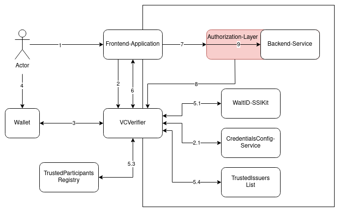

# VCVerifier for SIOP-2/OIDC4VP 

VCVerifier provides the necessary endpoints(see [API](./api/api.yaml)) to offer [SIOP-2](https://openid.net/specs/openid-connect-self-issued-v2-1_0.html#name-cross-device-self-issued-op)/[OIDC4VP](https://openid.net/specs/openid-4-verifiable-presentations-1_0.html#request_scope) compliant authentication flows. It exchanges [VerfiableCredentials](https://www.w3.org/TR/vc-data-model/) for [JWT](https://www.rfc-editor.org/rfc/rfc7519), that can be used for authorization and authentication in down-stream components.

[](https://www.fiware.org/developers/catalogue/)
[](https://opensource.org/licenses/Apache-2.0)
[](https://quay.io/repository/fiware/vcverifier)
[](https://coveralls.io/github/FIWARE/VCVerifier?branch=main)

## Contents


## Background

[VerifiableCredentials](https://www.w3.org/TR/vc-data-model/) provide a mechanism to represent information in a tamper-evident and therefor trustworthy way. The term "verifiable" refers to the characteristic of a credential being able to be verified by a 3rd party(e.g. a verifier). Verification in that regard means, that the it can be proofen that the claims made in the credential are as they where provided by the issuer of that credential. 
This characteristics make [VerifiableCredentials](https://www.w3.org/TR/vc-data-model/) a good option to be used for authentication and authorization, as a replacement of other credentials types, like the traditional username/password. The [SIOP-2](https://openid.net/specs/openid-connect-self-issued-v2-1_0.html#name-cross-device-self-issued-op)/[OIDC4VP](https://openid.net/specs/openid-4-verifiable-presentations-1_0.html#request_scope) standards define a flow to request and present such credentials as an extension to the well-established [OpenID Connect](https://openid.net/connect/).
The VCVerifier provides the necessary endpoints required for a `Relying Party`(as used in the [SIOP-2 spec](https://openid.net/specs/openid-connect-self-issued-v2-1_0.html#name-abbreviations)) to participate in the authentication flows. It verifies the credentials by using [WaltID SSIkit](https://walt.id/ssi-kit) as a downstream component to provide Verfiable Credentials specific functionality and return a signed [JWT](https://www.rfc-editor.org/rfc/rfc7519), containing the credential as a claim, to be used for further interaction by the participant.

## Overview

The following diagram shows an example of how the VCVerifier would be placed inside a system, using VerifiableCredentials for authentication and authorization. It pictures a Human-2-Machine flow, where a certain user interacts with a frontend and uses its dedicated Wallet(for example installed on a mobile phone) to participate in the SIOP-2/OIDC4VP flow.



The following actions occur in the interaction:

1. The user opens the frontend application.
2. The frontend-application forwards the user to the login-page of VCVerifier
3. The VCVerifier presents a QR-code, containing the ```openid:```-connection string with all necessary information to start the authentication process. The QR-code is scanned by the user's wallet.
4. The user approves the wallet's interaction with the VCVerifier and the VerifiableCredential is presented via the OIDC4VP-flow. 
5. VCVerifier requests verification of the credential with a defined set of policies at WaltID-SSIKit.
6. A JWT is created, the frontend-application is informed via callback and the token is retrieved via the token-endpoint.
7. Frontend start to interact with the backend-service, using the jwt.
8. Authorization-Layer requests the JWKS from the VCVerifier(this can happen asynchronously, not in the sequential flow of the diagram).
9. Authorization-Layer verifies the JWT(using the retrieved JWKS) and handles authorization based on its contents. 

## Deployment

### Container

The VCVerifier is provided as a container and can be run via ```docker run -p 8080:8080 quay.io/fiware/vcverifier```.


### Configuration

The configuration has to be provided via config-file. The file is either loaded from the default location at ```./server.yaml``` or from a location configured via the environment-variable ```CONFIG_FILE```. See the following yaml for documentation and default values:

```yaml
# all configurations related to serving the endpoints
server:
    # port to bin to
    port: 8080
    # folder to load the template pages from
    templateDir: "views/"
    # directory to load static content from
    staticDir: "views/static/"
# logging configuration
logging:
    # the log level, accepted options are DEBUG, INFO, WARN and ERROR
    level: "INFO"
    # should the log output be in structured json-format
    jsonLogging: true
    # should the verifier log all incoming requests 
    logRequests: true
    # a list of paths that should be excluded from the request logging. Can f.e. be used to omit continuous health-checks
    pathsToSkip:

# configuration directly connected to the functionality 
verifier: 
    # did to be used by the verifier.
    did:
    # address of the (ebsi-compliant) trusted-issuers-registry to be used for verifying the issuer of a received credential
    tirAddress:
    # Expiry(in seconds) of an authentication session. After that, a new flow needs to be initiated.
    sessionExpiry: 30
    # scope(e.g. type of credential) to be requested from the wallet. if not configured, not specific scope will be requested. 

ssiKit:
    auditorURL: http://my-auditor

```

### WaltID SSIKit

In order to properly work, a connection to the WaltID-SSIKit needs to be provided. For information about the deployment of SSIKit, check the [official documentation](https://github.com/walt-id/waltid-ssikit) or use the [helm-chart](https://github.com/i4Trust/helm-charts/tree/main/charts/vcwaltid). 


## Testing

## Development

## Open issues